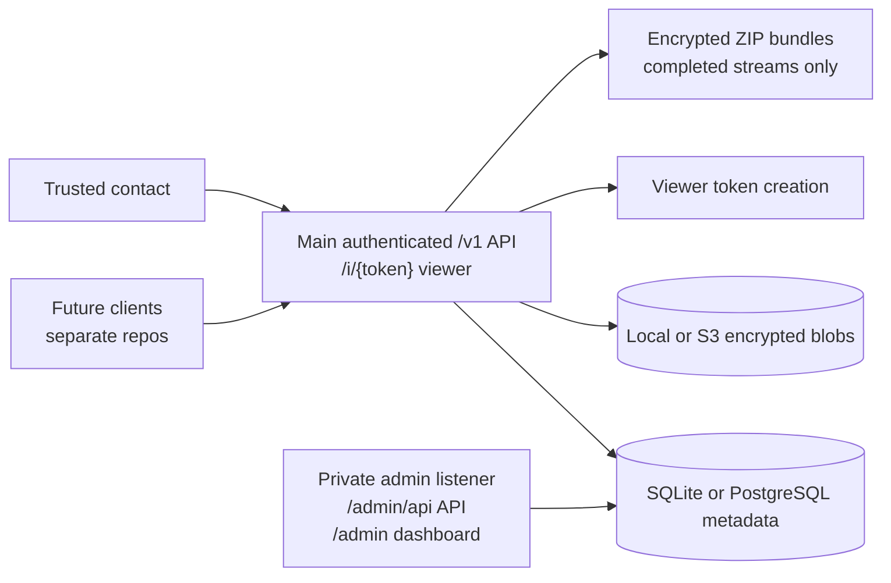

# Proofline Server

<p align="center">
  <a href="https://github.com/open-proofline/server/actions/workflows/ci.yml"></a>
  <a href="go.mod"></a>
  <a href="LICENSE"></a>
  <a href="#current-status"></a>
  <a href="SECURITY.md"></a>
  <a href="https://proofline.live/support/"></a>
  <a href="https://github.com/open-proofline/server/tags"></a>
  <a href="https://github.com/orgs/open-proofline/packages/container/package/server"></a>
  <a href="https://github.com/orgs/open-proofline/packages/container/package/stream-ingress"></a>
</p>

Proofline is experimental public-interest open-source privacy and evidence
infrastructure. This repository contains the Go server backend for encrypted
incident capture: authenticated `/v1` routes, private admin surfaces, metadata
and encrypted blob storage, encrypted bundle generation, deployment docs, and
server release workflow.

Proofline is not an emergency service, emergency dispatch system,
emergency-services integration, staffed response center, or guaranteed
real-time response system.

## Current Status

This repository is experimental and maintainer-led. It is not production-ready
public infrastructure or production-ready emergency infrastructure.

Current server status:

- Go module: `github.com/open-proofline/server`
- Main server image: `ghcr.io/open-proofline/server`
- Stream-ingress relay image: `ghcr.io/open-proofline/stream-ingress`
- Release binaries: `proofline-server-*`
- Default metadata backend: SQLite
- Optional metadata backend: PostgreSQL
- Default blob backend: local disk
- Optional committed-blob backend: S3-compatible object storage
- Optional coordination backend: Valkey/Redis-compatible coordination
- Main listener: authenticated `/v1` routes, read-only incident viewer, and
  token-neutral viewer assets
- Private-admin listener: `/admin`, `/admin/...`, `/admin/api/...`, and
  token-neutral admin assets

Current runtime protocol and default data-layout identifiers use Proofline
names. Historical reports and archived prompts may still mention earlier
`safety-recorder` identifiers.

## What This Repository Is

`open-proofline/server` is the server/backend component of Proofline. It is
responsible for:

- receiving already-encrypted recording chunks through authenticated main
  `/v1` routes
- storing metadata in SQLite by default or optional PostgreSQL
- storing encrypted blobs on local disk by default or optional S3-compatible
  object storage
- enforcing local temp-staging and account-scoped committed blob quotas
- serving the private admin web surface under `/admin`
- serving admin JSON routes only under the private-admin listener at
  `/admin/api/...`
- exposing a token-scoped read-only incident viewer for current local/prototype
  review
- generating encrypted ZIP evidence bundles with server-controlled entry names
- publishing the main server and stream-ingress relay images
- documenting server deployment, security, and release workflow

Evidence bundles are ZIP files containing encrypted chunks and JSON manifests.
They are not decrypted, playable, or merged media exports.

The simulator encrypts generated chunks by default with the accepted
post-quantum envelope (`ML-KEM-768 + HKDF-SHA384 + AES-256-GCM`), can stage
local file or ffmpeg test segments in desktop-recorder mode, and verifies
downloaded bundles locally when the run still has the local wrapping records.
Keys remain client-side and are not uploaded to the backend. Future production
key custody is expected to use a hybrid trusted-contact model; see
[docs/key-custody.md](docs/key-custody.md).

Planned production-cluster work is additive. SQLite metadata and local
filesystem blob storage remain supported. Optional PostgreSQL metadata,
S3-compatible object storage, and Valkey/Redis-compatible coordination are
available only when explicitly configured. Complete-upload idempotency is
implemented through metadata-backed upload-operation state, and Valkey can hold
short-lived complete-upload leases and retry hints when configured. Resumable or
partial-upload protocols remain future work. See
[docs/production-cluster-scope.md](docs/production-cluster-scope.md).

## What This Repository Is Not

This repository is not:

- the static public website
- the React web client or account portal
- an iOS app
- an Android app
- a protocol implementation or shared conformance test suite
- a production recording client
- an emergency service, emergency dispatch system, or staffed response center
- a notification delivery system
- a decryption service
- key escrow
- a hosted-account billing system
- a public admin/operator surface

Do not add web-client, iOS-client, Android-client, protocol, recording/capture,
notification, hosted-account billing, payment-gated access, decryption, key
escrow, playable export, or public admin/operator behavior here unless the
maintainer explicitly changes the repository strategy.

## Source-Of-Truth Map

Use the right source for the claim:

| Topic | Read |
|---|---|
| Server behavior, API, deployment, and security facts | This repository: `README.md`, `SECURITY.md`, and [docs/](docs/README.md) |
| Server v1 preview direction and current/future boundaries | [docs/v1-preview-direction.md](docs/v1-preview-direction.md), [docs/v1-preview-readiness-checklist.md](docs/v1-preview-readiness-checklist.md) |
| Server Codex workflows | [codex/README.md](codex/README.md), [codex/prompts/](codex/prompts/) |
| Project public website and public framing | [`open-proofline/website`](https://github.com/open-proofline/website) |
| Governance, political alignment, and public-good posture | [`open-proofline/website/docs/governance-and-political-alignment.md`](https://github.com/open-proofline/website/blob/main/docs/governance-and-political-alignment.md) |
| Reusable Proofline README structure and public voice | [`open-proofline/website/docs/repository-readme-baseline.md`](https://github.com/open-proofline/website/blob/main/docs/repository-readme-baseline.md) |
| Web-client behavior and prototype limits | [`open-proofline/web-client`](https://github.com/open-proofline/web-client) |

Keep repository-specific facts in the repository that owns them. Keep
project-wide governance posture in the website repository.

## Project Map

| Repository | Status | Role |
|---|---|---|
| [`open-proofline/website`](https://github.com/open-proofline/website) | Current, experimental | Static public website, public framing, governance posture, README baseline, and website Codex workflows. |
| [`open-proofline/server`](https://github.com/open-proofline/server) | Current, experimental | Go backend, authenticated main API, private admin web surface, read-only incident viewer, storage, migrations, deployment docs, and server release workflow. |
| [`open-proofline/web-client`](https://github.com/open-proofline/web-client) | Current, experimental | React account portal and incident-review prototype for account flows and metadata review. It is not a recorder, emergency workflow, production decryption client, or production account portal. |
| `open-proofline/ios-client` | Planned | Future native iOS incident capture, encrypted staging, upload, local account flows, and platform-specific recording behavior. |
| `open-proofline/android-client` | Planned | Future native Android incident capture, encrypted staging, upload, local account flows, and platform-specific recording behavior. |
| `open-proofline/protocol` | Planned | Future shared API specs, encryption envelope specs, bundle manifests, compatibility matrix, and conformance tests. |

Planned repositories should not be described as implemented until they exist and
their scope is documented.

## Safety And Deployment Boundaries

This project is not production-ready public infrastructure. The main `/v1` API
requires local account sessions for product routes and uses app-level route
class rate limits, but broad public exposure still needs route-by-route
deployment review, TLS, edge abuse controls, browser credential review, logging
review, proxy hardening, and operational testing.

Configurable public self-registration is disabled by default. Enabling open
registration adds only email-verified account creation and does not by itself
approve broad public `/v1` exposure. Optional browser cookie sessions add CSRF
checks and configured credentialed CORS for future production web-client use,
but they also need reviewed deployment rules.

Existing `/admin/api/...` JSON routes are mounted only on the private-admin
listener and require authenticated admin sessions with completed admin
second-factor setup and active-factor verification when email challenge, TOTP,
or WebAuthn is active. The private-admin listener also serves the `/admin`
dashboard surface and must stay behind localhost, LAN, WireGuard, a firewall,
or a strict reverse proxy. Separate bind addresses are a deployment boundary,
not a complete security model.

Public web-client deployments must follow the reviewed route, CORS, CSRF,
cookie, cache, edge, and logging boundary in
[docs/public-web-client-deployment-boundary.md](docs/public-web-client-deployment-boundary.md).

## Public Claim Boundaries

Do not imply that this repository currently provides:

- production readiness
- emergency dispatch or emergency-services integration
- guaranteed response
- a staffed response center
- production mobile capture
- trusted-contact notifications
- live context sharing
- backend, browser, or trusted-contact decryption
- raw server-held media keys
- key escrow
- hosted-account billing, subscriptions, or payment-gated access as live
  behavior
- public production admin/operator surfaces
- legal admissibility or legal reliability

## Governance And Public-Good Posture

Proofline is intended to grow as public-good open-source infrastructure. The
planned long-term direction is a non-distributing cooperative or similar
mission-locked structure aligned with cooperative and libertarian socialist
principles. Pay should be for defined labour, not ownership extraction.

Read the canonical project posture in
[`open-proofline/website/docs/governance-and-political-alignment.md`](https://github.com/open-proofline/website/blob/main/docs/governance-and-political-alignment.md).

The reusable Proofline README baseline and public voice guidance live in
[`open-proofline/website/docs/repository-readme-baseline.md`](https://github.com/open-proofline/website/blob/main/docs/repository-readme-baseline.md).

Donations and contributions do not create accounts, unlock features, provide
support priority, or provide emergency assistance.

## Planned Incident Modes

Proofline should separate capture from escalation. A user may want to preserve a private encrypted record without treating every recording as an emergency.

Planned incident categories include:

| Mode | Purpose | Default escalation |
|---|---|---|
| Emergency incident | Active safety risk where trusted contacts may need urgent access. | Trusted-contact alert immediately or after a short configured delay. |
| Interaction record | Non-emergency record of important interactions, such as with police, security, landlords, employers, service providers, or other authorities. | No automatic escalation by default. |
| Safety check | Timed check-in flow for walking home, meeting someone, travel, fieldwork, or other elevated-risk situations. | Trusted contacts alerted if the user misses the check-in. |
| Evidence note | Quick photo, audio, location, or note bundle for damage, harassment, threats, or disputes. | No automatic escalation by default. |

The current backend stores generic incidents by default and can optionally store
`incident_mode`, `capture_profile`, `escalation_policy`, and `sharing_state`
metadata on main incident creation. Those fields are labels only: they do not
grant access, send notifications, change retention, change key custody, expose
trusted-contact workflows, or change public viewer and bundle behavior. See
[docs/incident-modes.md](docs/incident-modes.md).

Authenticated account owners can also invite local accounts into
trusted-contact relationships, register or replace trusted-contact public-key
metadata, mark contact keys lost or revoked, and create or revoke
incident/stream-scoped sharing grants for their own incidents. Those grants can
authorize private API storage and delivery of contact-wrapped CEK/media-key
metadata for owned incidents or streams. Signed-in accepted trusted contacts
can read only grant-scoped wrapped-key records whose owner relationship,
recipient-bound contact key, grant, and wrapped-key record are all active.
Relationship records alone do not add incident reads, browser or backend
decryption, public viewer changes, notifications, raw key storage, or key
escrow.

## What Works Today

- Main authenticated `/v1` API listener group
- Private-admin listener for admin-only JSON routes, `/admin`, and
  `/admin/static/...`
- Read-only incident viewer routes mounted on the main listener
- Local username/password accounts for regular users and admins
- Configurable account registration modes: disabled, admin-created accounts
  only, open self-registration with email verification, and a paid-registration
  placeholder that fails closed until billing is implemented
- Email challenge, TOTP, and disabled-by-default WebAuthn/FIDO2 second-factor
  setup. New admin-created and
  open-registration accounts require setup before main product-route access;
  existing migrated accounts default to `not_required` for preview
  compatibility for product routes. Admin accounts must complete second-factor
  setup before private `/admin` operator actions or `/admin/api/...` JSON admin
  actions; legacy admin `not_required` accounts are gated on the private admin
  surface until setup is complete. Email challenge codes are single-use,
  expiring, emailed through the configured sender, and stored only as hashes.
  Email challenge, TOTP, and configured WebAuthn factors require per-session
  verification before product-route or admin operator access after primary
  login. TOTP setup stores authenticator-app seeds as credential material.
  WebAuthn setup is disabled until an RP ID and exact allowed
  origins are configured, stores public credential material and single-use
  expiring challenge sessions, and can verify active passkey or roaming
  security-key factors for bearer and browser sessions. Private-admin assisted
  second-factor recovery can reset enrolled email, TOTP, and WebAuthn factors
  with controlled reason codes, audit metadata, setup-required state, and
  target-session revocation. It is not self-service recovery and does not
  change key custody or decrypt evidence.
- Opaque server-side sessions with expiry and revocation
- Optional main `/v1` browser cookie-session login/logout, session recovery,
  CSRF protection for cookie-authenticated unsafe requests, and credentialed
  CORS for explicitly configured web origins, subject to the public web-client
  deployment boundary in
  [docs/public-web-client-deployment-boundary.md](docs/public-web-client-deployment-boundary.md)
- Private admin-only HTML surface under `/admin` for bootstrap, login, local
  second-factor setup/verification gates, account listing, account creation,
  password, session revocation, second-factor recovery, and safe incident
  operation workflows
- SQLite metadata and local disk encrypted blob storage by default
- Optional PostgreSQL metadata backend for new deployments
- Optional S3-compatible encrypted blob storage for committed chunks
- Account-scoped committed encrypted blob quota, defaulting to 10 GB per owner
  account as a preview abuse/cost control
- Local temp-upload staging quota, defaulting to 1 GB for both local and
  S3-compatible blob backends before final chunk commit
- Immutable chunk uploads with SHA-256 verification
- `Idempotency-Key` support for equivalent complete chunk upload retries
- Optional Valkey/Redis-compatible short-lived complete-upload leases and
  `upload_in_progress` retry hints when coordination is explicitly configured
- Separate `cmd/stream-ingress` regional relay with token-neutral
  liveness/readiness routes, safe aggregate readiness categories, configured
  complete encrypted chunk upload, temporary local ciphertext staging, hash
  validation, and forwarding to service-authenticated core relay
  preflight/commit endpoints, plus main-API issuance of configured short-lived
  relay upload and fanout capabilities for authorized open streams, optimistic
  near-live encrypted SSE fanout marked unconfirmed until the core backend
  commits exact ciphertext, and bounded `confirmed`, `rejected`, or
  `terminal_failure` fanout state after the core commit outcome
- Authenticated duplicate chunk reconciliation for comparing accepted metadata with
  an expected chunk fingerprint
- Optional incident-mode, capture-profile, escalation-policy, and sharing-state
  metadata on main incident create/read routes
- Owner-only public-safe incident list/detail metadata reads for future
  web-client use, without exposing notes, chunks, checkins, stored paths, owner
  IDs, wrapped keys, ciphertext, raw keys, plaintext, or user safety narrative
- Private-admin legacy unowned incident review, reassignment, and keep-unowned
  audit APIs with count-oriented candidate metadata and controlled reason codes
- Owner-scoped account/device recipient-key metadata with active, replaced,
  revoked, and lost states for future wrapping eligibility
- Account-to-account trusted-contact relationship invites with accept, decline,
  revoke, and replace states
- Owner-scoped trusted-contact public-key metadata with pending, active,
  replaced, revoked, and lost states, plus sharing-grant records for owned
  incidents or streams
- Owner-scoped wrapped CEK/media-key metadata storage and private API delivery
  for active sharing grants
- Authenticated trusted-contact wrapped-key reads for accepted recipient
  accounts when the relationship, recipient-bound contact key, grant, and
  wrapped-key record are active
- Accepted post-quantum client-side chunk envelope as the runtime upload
  validation and simulator default
- Media streams with `open`, `complete`, and `failed` states
- Completed encrypted stream and incident ZIP evidence bundle downloads
- Scoped viewer tokens with a default 24-hour expiry
- App-level main API route limiting by safe route class, with local in-memory
  counters by default and optional Valkey/Redis-compatible counters when
  coordination is explicitly configured
- App-level public viewer rate limiting by safe route class, with local
  in-memory counters by default and optional Valkey/Redis-compatible counters
  when coordination is explicitly configured
- Validated backend-selection config defaults for SQLite metadata, optional PostgreSQL metadata, local encrypted blobs, optional S3-compatible encrypted blobs, no coordination by default, and optional Valkey/Redis-compatible coordination
- Simulator CLI for direct main-API encrypted upload, check-in, stream
  completion, bundle download/decrypt-verification, opt-in stream-ingress relay
  upload mode, and durable desktop-recorder staging flows
- Docker image builds and GitHub Actions / GHCR publishing for the main server
  image and the stream-ingress relay image

## What Is Not Implemented Here

- No iOS app
- No Android app
- No web client or account portal in this repository
- No protocol repository or shared conformance test suite
- No production recording client implementation
- No mode-driven incident access, notification, retention, key-custody, or
  viewer behavior
- No production client-side encryption implementation
- No implemented capture stream group, stream-variant, or evidence-supersession
  model beyond the current concrete media stream upload lanes
- No implemented resumable or partial upload protocol; current Valkey upload
  leases are short-lived complete-upload hints, not durable evidence truth
- No implemented regional relay replay, metrics endpoint, production relay
  deployment automation, relay Valkey counters, or production service-identity
  rotation beyond the early static relay-to-core token; relay readiness reports
  only safe aggregate categories
- No implemented live or partial stream chunk access before stream completion
- No backend/browser decryption, raw key handling, server escrow, break-glass
  key access, or playable media export
- No self-service lost-factor recovery, password recovery, payment processing,
  subscriptions, checkout sessions, billing webhooks, OAuth, or JWT
- No push notifications, SMS, or Messenger integration
- No public account portal or public admin dashboard
- No built-in TLS, mode-specific retention policy, backup lifecycle enforcement, or production deployment hardening
- No emergency-services integration; users or trusted contacts remain responsible for contacting emergency services

## Architecture

Proofline Server runs separate main and private-admin HTTP listener groups from the same Go binary. The main listener serves authenticated non-admin `/v1` routes and the token-gated, read-only incident viewer. Existing `/admin/api/...` JSON routes stay authenticated and admin-only, but are mounted only on the private-admin listener alongside the `/admin` dashboard route tree.



For more diagrams and package-level details, see [docs/architecture.md](docs/architecture.md) and [docs/code-map.md](docs/code-map.md). The planned cluster expansion is documented separately in [docs/production-cluster-scope.md](docs/production-cluster-scope.md).

## Quick Start

Requirements:

- Go 1.26.4
- SQLite via the bundled Go SQLite driver dependency
- TOTP generation and validation through the bundled Go OTP dependency
- WebAuthn/FIDO2 ceremony validation through the bundled go-webauthn dependency
- Local disk storage for encrypted uploaded blobs by default

Run the backend:

For repeatable local configuration, set the bootstrap secret through a private
secret file referenced by TOML:

```toml
[auth]
bootstrap_secret_file = "/path/to/local-bootstrap-secret"
```

Then run:

```bash
go run ./cmd/api --config /path/to/proofline.toml
```

For a one-off local shell, an environment override remains supported:

```bash
SAFE_AUTH_BOOTSTRAP_SECRET='replace-with-local-bootstrap-secret' \
go run ./cmd/api
```

The repository root includes `proofline.toml`, a safe local-first example
config that matches the built-in defaults. TOML config is the recommended
deployment shape; existing `SAFE_*` environment variables remain supported and
override TOML values. Use `--config /path/to/proofline.toml` or
`SAFE_CONFIG_FILE=/path/to/proofline.toml` for a custom file, and prefer
`*_file` TOML keys or `SAFE_*_FILE` environment variables for secret-bearing
settings.

By default this starts:

| Listener | Address |
|---|---|
| Main API and incident viewer | `127.0.0.1:8080` |
| Private admin dashboard | `127.0.0.1:8081` |

The private admin web surface is available on the private-admin listener at
`http://127.0.0.1:8081/admin`.

In another terminal, create the first admin account:

```bash
curl -sS -X POST http://127.0.0.1:8081/admin/bootstrap \
  -H 'Content-Type: application/x-www-form-urlencoded' \
  --data-urlencode 'bootstrap_secret=replace-with-local-bootstrap-secret' \
  --data-urlencode 'username=admin' \
  --data-urlencode 'password=replace-with-a-long-local-password'
```

Stop the server, remove the bootstrap secret from TOML, the environment, or
the secret mount, and start it again. The bootstrap route is disabled once an
admin account exists.

In another terminal, run the simulator:

```bash
PROOFLINE_SIM_USERNAME=admin \
PROOFLINE_SIM_PASSWORD='replace-with-a-long-local-password' \
go run ./cmd/simclient --chunks 5 --interval 1s --download-bundle
```

The simulator creates an incident, creates a viewer token without printing the
token-bearing viewer URL, encrypts and uploads test chunks into a media stream,
sends checkins, completes the stream, downloads the encrypted bundle, and
verifies local decryption. See [docs/simulator.md](docs/simulator.md) for
encrypted bundle output, offline bundle verification, the durable
desktop-recorder mode, local file input, ffmpeg segment capture, and
poor-network retry controls, and simulator-only contact-wrapped key metadata
artifacts.

## Docker

Build from the repository root:

```bash
docker build -t proofline-server .
docker build -f Dockerfile.ingress -t proofline-stream-ingress .
```

Run with local-only port publishing and a named data volume:

```bash
docker run --rm \
  -e SAFE_AUTH_BOOTSTRAP_SECRET='replace-with-local-bootstrap-secret' \
  -p 127.0.0.1:8080:8080 \
  -p 127.0.0.1:8081:8081 \
  -v proofline-server-data:/var/lib/proofline \
  proofline-server
```

Use the private `/admin` bootstrap screen, or `POST /admin/bootstrap` with form
fields, to create the first admin account. Then restart the container without
the bootstrap secret in TOML, the environment, or the secret mount.

Container defaults bind to `0.0.0.0` inside the container. Restrict host exposure with port publishing, firewall rules, WireGuard, or a reverse proxy. See [docs/deployment.md](docs/deployment.md).

For custom container configuration, mount a reviewed TOML file over
`/etc/proofline/proofline.toml`; the image entrypoint already passes that path
with `--config`. Keep real secrets in mounted secret files rather than in
committed TOML.

The relay image builds `cmd/stream-ingress` only and is published separately as
`ghcr.io/open-proofline/stream-ingress`. It exposes only the relay listener
inside the container; local Compose relay smoke remains loopback-bound and does
not make the relay or the main `/v1` API production-ready public
infrastructure.

## Validation

For docs-only changes:

```bash
scripts/check-markdown-links.py
git diff --check
```

For Go code changes:

```bash
gofmt -w ./cmd ./internal ./migrations
go test ./...
go vet ./...
git diff --check
```

Go tests are not required for docs-only changes unless code changed. Do not use
`v1 preview`, `v1.0.0`, or real-user evidence-upload readiness language unless
[docs/v1-preview-readiness-checklist.md](docs/v1-preview-readiness-checklist.md)
has been run and every applicable blocker is satisfied.

## Documentation

- [Docs index](docs/README.md)
- [v1 preview direction](docs/v1-preview-direction.md)
- [v1 preview readiness checklist](docs/v1-preview-readiness-checklist.md)
- [Getting started](docs/getting-started.md)
- [Architecture](docs/architecture.md)
- [Configuration](docs/configuration.md)
- [Production cluster scope](docs/production-cluster-scope.md)
- [Cluster backup, restore, and failure runbook](docs/cluster-backup-restore-runbook.md)
- [PostgreSQL metadata migration path and SQLite-to-PostgreSQL runbook](docs/postgresql-metadata-migration.md)
- [Cluster-safe upload operation semantics](docs/cluster-safe-upload-semantics.md)
- [Resumable upload and upload lease protocol](docs/resumable-upload-lease-protocol.md)
- [Regional stream ingress relay design](docs/regional-stream-ingress-relay.md)
- [Incident capture modes](docs/incident-modes.md)
- [Mode-aware retention policy](docs/mode-aware-retention-policy.md)
- [/v1 access control](docs/v1-access-control.md)
- [Main API public exposure listener split](docs/public-api-listener-split.md)
- [Private admin web scope](docs/private-admin-web-scope.md)
- [Legacy unowned incident reassignment](docs/legacy-unowned-incident-reassignment.md)
- [Encryption](docs/encryption.md)
- [iOS local recorder prototype](docs/ios-local-recorder-prototype.md)
- [Key custody and emergency access](docs/key-custody.md)
- [Pure post-quantum encryption envelope](docs/post-quantum-envelope.md)
- [Contact key sharing, grants, and wrapped-key metadata](docs/contact-key-sharing-grants.md)
- [Contact-wrapped key metadata simulator prototype](docs/contact-wrapped-key-metadata-simulator.md)
- [Browser-side decryption design](docs/browser-decryption.md)
- [Live partial stream access boundary](docs/live-partial-stream-access-boundary.md)
- [Break-glass key access design](docs/break-glass-key-access.md)
- [API reference](docs/api.md)
- [Deployment notes](docs/deployment.md), including SQLite WAL operations
- [Retention, backup, and deletion](docs/retention-backup-deletion.md)
- [Incident deletion and retention enforcement](docs/incident-deletion-retention-enforcement.md)
- [Security model](docs/security-model.md)
- [Threat model](docs/threat-model.md)
- [Simulator](docs/simulator.md)
- [Development](docs/development.md)
- [Compose smoke tests](compose/README.md)
- [Code map](docs/code-map.md)
- [Technical review reports](docs/reports/README.md)

## AI-Assisted Development

This project has been developed with substantial assistance from OpenAI Codex.

Codex has been used to draft, refactor, test, document, and review parts of the Go backend and Markdown documentation. All accepted changes are reviewed, tested, and committed by the maintainer.

AI assistance does not replace human responsibility. The maintainer remains responsible for:

- code correctness
- security review
- licensing decisions
- release decisions
- deployment choices
- any real-world use of the software

Use of Codex does not imply endorsement, audit, certification, or maintenance by OpenAI.

## Backlog workflow

Use `80-backlog-scan-issue-drafts.md` to generate reviewed local issue drafts under a branch-scoped directory such as `.backlog-drafts/YYYY-MM-DD/<branch-slug>/`.

Review those drafts manually before creating GitHub issues. Drafts are generated review artifacts, not the long-term source of truth once GitHub issues exist.

Only after review, use `85-create-github-issues-from-drafts.md` to generate `scripts/create-backlog-issues.sh` and `.backlog-drafts/.../create-issues-review.md`. Do not run the generated script unless the maintainer explicitly asks for issue creation.

Do not let Codex create GitHub issues directly during the initial scan.

## Security Reporting

Do not report security vulnerabilities through public GitHub issues. Use
GitHub private vulnerability reporting for this repository, and see
[SECURITY.md](SECURITY.md) for supported versions, scope, and handling
expectations.

## Security

Viewer links, `/v1` bearer session tokens, and browser session cookies are credentials and should be treated as secrets. Browser cookie mode should use HttpOnly Secure cookies, explicit allowed origins, `credentials: "include"`, and CSRF headers for unsafe requests; browser token persistence should not use localStorage in production. Public deployment still needs TLS, rate limiting, log review, proxy hardening, operational testing, and deployment-specific retention, backup, and deletion enforcement. Do not route `/v1` as an unreviewed public catch-all; expose only explicitly reviewed route groups, and keep `/admin/api/...` and `/admin` off public edges.

Do not publish raw viewer tokens, incident tokens, idempotency keys, request
bodies, uploaded bytes, plaintext, raw keys, wrapped-key ciphertext, stored
paths, object keys, private deployment details, exploit details, or user safety
data in public docs, prompts, issue bodies, logs, screenshots, or examples.

## Release And Deployment Notes

GitHub Actions build and publish the main server image and stream-ingress relay
image for trusted branches and version tags. Release binaries use
`proofline-server-*` names. See [CHANGELOG.md](CHANGELOG.md) for release notes
and [docs/deployment.md](docs/deployment.md) for deployment guidance.

Release or deployment tooling does not make Proofline production-ready public
infrastructure. Treat any broad public `/v1`, public web-client, or hosted
service deployment as a separate reviewed deployment task.

## Roadmap

- Keep web-client work in `open-proofline/web-client`, and create future
  `open-proofline/ios-client`, `open-proofline/android-client`, and
  `open-proofline/protocol` repositories when their scopes are ready
- Plan any future protocol or data-layout compatibility migrations separately from the completed repository/module/artifact rename
- Continue hardening optional PostgreSQL metadata support while preserving SQLite local/default support
- Complete the remaining cluster-safe upload operation semantics before multi-node production deployment
- Keep cluster backup, restore, and failure runbooks current as optional PostgreSQL, S3-compatible storage, and coordination behavior evolve
- Keep the regional stream-ingress relay temporary,
  ciphertext-only, and subordinate to the core API for authorization,
  idempotency, durable blob commits, and metadata while metrics, production
  service identity, and deployment hardening are added later. Current relay
  fanout is optimistic, encrypted-only, explicitly unconfirmed until core
  commit succeeds, and followed by bounded confirmation, rejection, or terminal
  failure state when the commit outcome is known. Current relay readiness is
  safe aggregate status only
- WireGuard-only bind/firewall deployment guidance
- Mode-driven access, escalation, retention, sharing, viewer, and key-custody
  behavior after protocol and security design
- Server-side support for trusted-contact dead-man switch workflows after access-control design
- Production key custody, account/device wrapped-key delivery, trusted-contact
  account access, grant-scoped contact delivery, and browser/client-side
  decryption
- Optional break-glass/dead-man-switch key access
- Playable media export
- Reverse-proxy/TLS hardening for incident viewer exposure
- Complete route-by-route [`/v1` public deployment review](docs/v1-access-control.md) before broad public product API deployment

## License

Proofline Server is licensed under the GNU Affero General Public License v3.0 only (`AGPL-3.0-only`). See [LICENSE](LICENSE).
