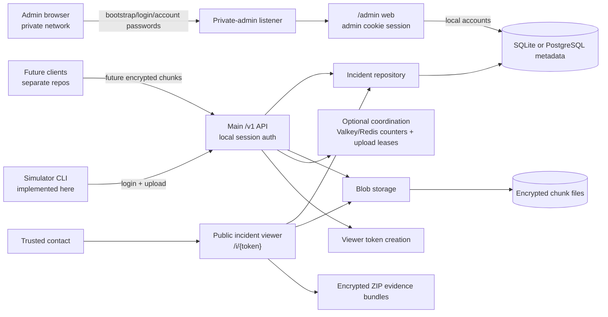
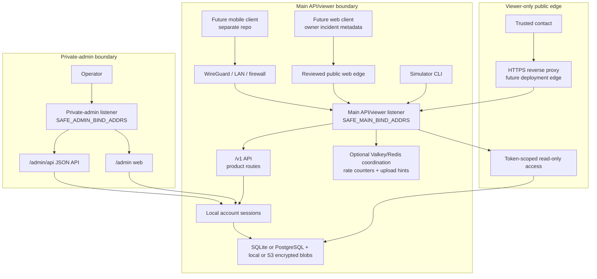
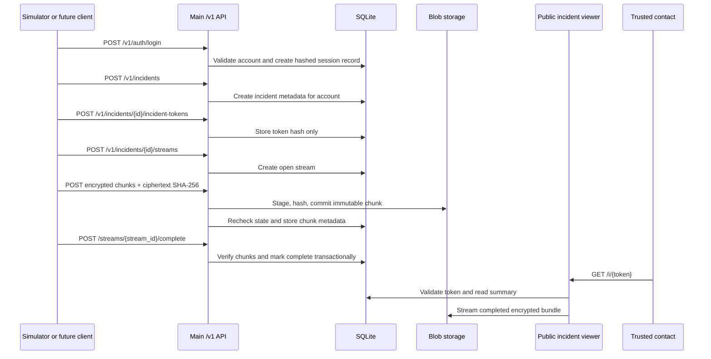
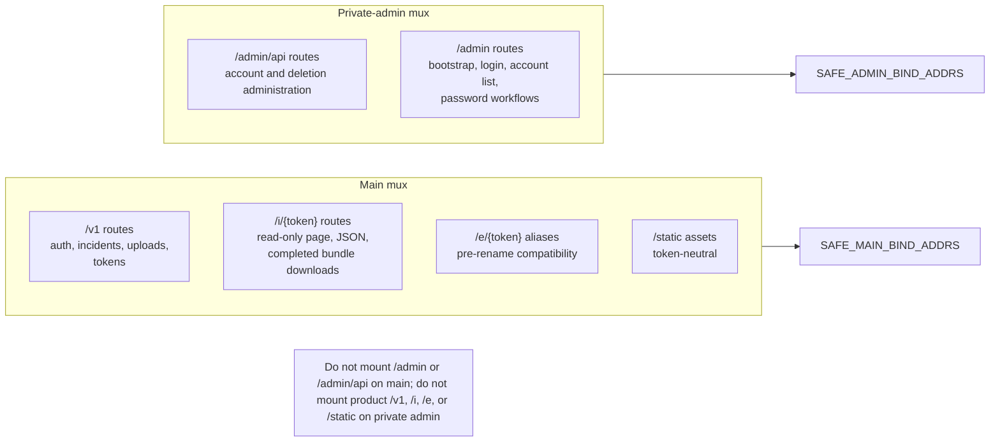

# Architecture

Proofline Server is currently a single Go backend binary with separate main
API/viewer and private-admin HTTP listener groups. It stores incident metadata
in SQLite by default or optional PostgreSQL, encrypted uploaded chunks on local
disk by default with optional S3-compatible object storage for committed
encrypted chunks, a private `/admin` dashboard listener, and optional
Valkey/Redis-compatible short-lived coordination when explicitly configured.
The separate regional stream-ingress relay boundary currently has
`cmd/stream-ingress` health/readiness routes, core API issuance of configured
short-lived relay upload and fanout capabilities for authorized open streams,
service-authenticated core relay preflight, commit, and fanout authorization
endpoints, relay complete-chunk upload handling with relay-local temporary
ciphertext staging and core forwarding, and optimistic encrypted unconfirmed
fanout followed by bounded backend confirmation, rejection, or terminal-failure
state. Its readiness route reports only safe aggregate categories for manual
ready state, core forwarding configuration, upload readiness, and temp-staging
pressure. Replay, metrics, relay Valkey counters, production service-identity
rotation, and deployment automation remain planned in
[regional-stream-ingress-relay.md](regional-stream-ingress-relay.md).

This repository is the server/backend component only. In the current
`open-proofline` organisation it is `open-proofline/server`. Web, iOS, Android,
and shared protocol work should live in separate repositories.

The long-term product direction is broader than emergency-only recording. Future
clients may support emergency incidents, non-emergency interaction records,
timed safety checks, and evidence notes. The current backend stores generic
incidents by default, can store optional incident-mode, capture-profile,
escalation-policy, and sharing-state metadata on main incident create/read
routes, exposes owner-only public-safe incident list/detail metadata for future
web-client reads, and has local username/password accounts with opaque
server-side sessions for the main `/v1` API, private-admin JSON routes under
`/admin/api/...`, plus a private admin web surface under `/admin`.
Sharing metadata, owner wrapped-key records, and signed-in trusted-contact
wrapped-key reads are implemented behind authenticated `/v1` routes.
Mode-driven access, escalation, retention, key custody, trusted-contact
incident delivery, notification delivery, and mobile/web clients are not
implemented yet. Planned mode behavior, escalation, migration, and
viewer-wording boundaries are documented in [incident-modes.md](incident-modes.md),
and current local session behavior plus future public product API, separately
bound private admin API, role, and grant boundaries are documented in
[v1-access-control.md](v1-access-control.md).

The repository does not contain an iOS app, Android app, web client, protocol
package, production recording client, production client key storage, key
sharing, browser/client-side decryption, server-assisted break-glass key access,
notification system, trusted-contact delivery model, future public product API,
future separately bound private admin API, OAuth/JWT identity integration, or
playable media export. The Go simulator defaults to the accepted PQ payload
envelope for development and test flows, can use the older v1 AES-GCM envelope
only through explicit compatibility flags, and can produce local
desktop-recorder test segments. Future key custody and emergency access design
is documented in [key-custody.md](key-custody.md),
[browser-decryption.md](browser-decryption.md), and
[break-glass-key-access.md](break-glass-key-access.md).

## High-Level System



## Open Proofline Repository Roles

The current organisation is `open-proofline`.

Current and planned repositories:

```text
open-proofline/server
open-proofline/web-client
open-proofline/ios-client
open-proofline/android-client
open-proofline/protocol
```

Responsibilities:

| Repository | Responsibility |
|---|---|
| `open-proofline/server` | Go backend, authenticated main API, private admin web surface, public incident viewer, SQLite migrations, encrypted blob storage, deployment docs, and server release workflow. |
| `open-proofline/web-client` | Account portal, authorised incident review, trusted-contact access, and eventual replacement for the current token-only viewer. |
| `open-proofline/ios-client` | iOS incident capture, encrypted staging, upload, local account flows, and platform-specific recording behavior. |
| `open-proofline/android-client` | Android incident capture, encrypted staging, upload, local account flows, and platform-specific recording behavior. |
| `open-proofline/protocol` | Shared API specs, encryption envelope specs, bundle manifests, compatibility matrix, and conformance tests. |

The Go module path is `github.com/open-proofline/server`, release binaries use `proofline-server-*` names, and the published GHCR image is `ghcr.io/open-proofline/server`. Current runtime protocol and default data-layout identifiers use Proofline names. Historical reports and archived prompts may still mention earlier `safety-recorder` identifiers.

## Server Boundary

This repository should remain scoped to backend server responsibilities:

- HTTP API implementation
- SQLite migrations and metadata repository code
- encrypted blob storage
- current token-scoped incident viewer
- deployment and operations docs
- simulator/reference backend flow
- backend security, retention, and threat-model docs

Do not add future web-client, iOS-client, Android-client, or protocol implementation here unless the maintainer explicitly changes the repository strategy.

## Example Network Topology



## Incident Data Flow



Future clients may classify incidents as emergency incidents, interaction
records, safety checks, or evidence notes through the current optional private
API metadata fields. Those fields are not behavior flags and do not change
access, notification, retention, sharing, key custody, viewer, or bundle
behavior.

## Main/Admin Server Boundary



## Evidence Bundles

Completed stream and incident downloads are ZIP files generated on demand. ZIP entry names are controlled by the server and manifests are generated from trusted database metadata. Bundles contain encrypted chunks and JSON manifests only.

They are not decrypted, playable, or merged media exports.

## Regional Ingress Relay Boundary

The regional stream-ingress relay boundary is separate from the main API and
private-admin listeners. The current `cmd/stream-ingress` command exposes only
coarse health/readiness routes, a narrow complete-chunk upload route, and a
narrow fanout subscription route; readiness categories are bounded and do not
include labels, URLs, credentials, paths, counts, or per-user state. It is not
a durable evidence store and not a broad API gateway. The core API can issue
signed, expiring upload and fanout
capabilities bound to one authorized open stream and can accept
service-authenticated relay preflight/commit/fanout authorization calls for
that bound stream context. A relay capability or unconfirmed fanout event by
itself does not prove durable evidence preservation. The relay command stages
ciphertext temporarily, validates the declared hash, forwards complete
encrypted chunks to the core API, and can optimistically send encrypted
`near_live_unconfirmed` SSE events to authorized subscribers, followed by
bounded `confirmed`, `rejected`, or `terminal_failure` state for the same
ciphertext metadata after the core commit outcome is known. The core API
remains responsible for account/session or future upload authorization, relay
capability validation, incident and stream state, idempotency decisions,
duplicate reconciliation, final blob commits, and metadata.

The relay must not expose `/admin`, `/admin/api/...`, public incident viewer
routes, bundle downloads, deletion, retention, backup, restore, escrow,
break-glass, decryption, raw-key, or operator routes. Loss of relay temporary
staging must be recoverable by client retry.

## Emergency Services Boundary

Proofline Server does not currently contact emergency services. Future dead-man switch or safety-check designs should rely on trusted contacts to review the context and decide whether to call emergency services unless a future jurisdiction-specific emergency-services integration is explicitly designed, implemented, and documented.
